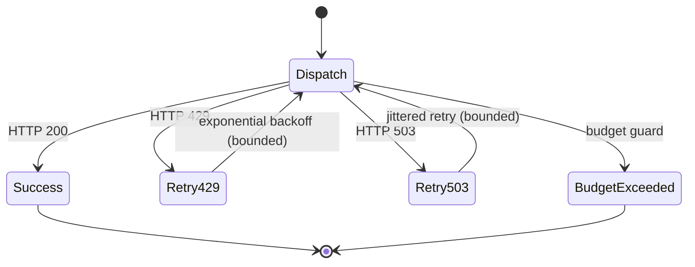

# Hugging Face Adapter

The Hugging Face (HF) adapter powers optional LLM assist for rewrite and critique operators. It sits behind the provider policy guardrails and implements retry, backoff, and budgeting.

## Error handling flow

1. **Dispatch** builds the HF request and checks `LLM_COST_BUDGET_USD` before sending.
2. **Retry429** applies exponential backoff with jitter for rate limits until the max retry count is reached.
3. **Retry503** handles cold starts with shorter retry windows.
4. **BudgetExceeded** short-circuits without hitting the network when spend would exceed the configured budget.

The adapter annotates each response with retry counts so `/engine/transform` traces clearly show whether backoff was applied.

## Testing guidance

- Default unit tests mock the HF client; no live token is required for CI.
- Live integration tests are optional and should be marked `@pytest.mark.integration` so they are skipped unless explicitly requested.
- When writing new tests, assert on emitted metrics (e.g. `neopr_hf_backoffs_total`) to guarantee retry paths remain observable.
