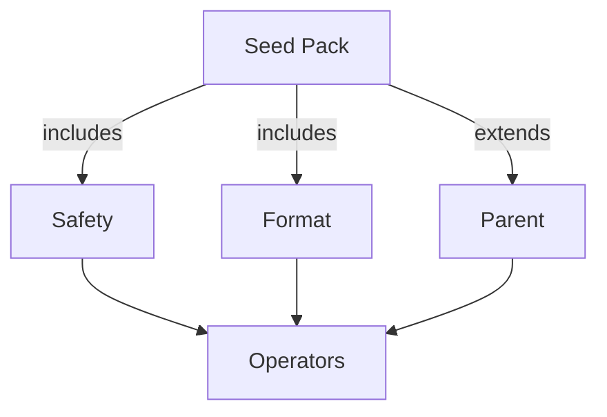

# Rulepacks

Rulepacks describe how NeoPrompt composes prompt engineering operators for a given assistant, category, or environment. They can extend each other and merge fields to create layered behavior without duplicating configuration.

## Core concepts

- **Seed packs** define the minimal operators for an assistant/category pair.
- **Includes** pull in additional packs (e.g. safety, formatting) for reuse.
- **Extends** allows overriding fields from a parent pack while preserving most defaults.



## Merge semantics

When multiple packs are combined, fields merge deterministically. Use the table below as a quick reference while authoring YAML files.

| Field type | Merge rule | Example |
|------------|------------|---------|
| Lists      | Concatenate then de-duplicate while preserving order | `operators: [clarify, tighten] + [tighten, verify] → [clarify, tighten, verify]` |
| Numbers    | Last writer wins | `quality.min_score: 80 (parent) + 90 (child) → 90` |
| Booleans   | Logical OR unless explicitly set in child | `strict_json: true (parent) + false (child) → false` |
| Objects    | Deep-merge recursively | `hparams.temperature: 0.2 (parent) + 0.1 (child) → 0.1` |
| Operators  | Evaluated in listed order after merge | `operator_plan: [clarify, llm_rewrite, llm_critique]` |

!!! tip
    Use the merge table above as your mental model when writing new packs or debugging inheritance chains.

## Example seeds

```yaml
# core/coding.yaml
id: core/coding
assistant: chatgpt
category: coding
operators:
  include:
    - clarify
    - structure
    - tighten_language
```

```yaml
# safety/default.yaml
id: safety/default
includes:
  - core/common
operators:
  include:
    - safety_guard
```

```yaml
# qa/format_contract.yaml
id: qa/format_contract
extends: safety/default
operators:
  include:
    - format_contract
```

## Schema support

Rulepack schemas already live in [`docs/rulepack.schema.json`](rulepack.schema.json). Use them to validate new packs locally:

```bash
pip install jsonschema
jsonschema -i prompt-templates/rulepacks/my-pack.yaml docs/rulepack.schema.json
```

Keeping schema validation in your development flow ensures CI and runtime agree on structure and naming.
